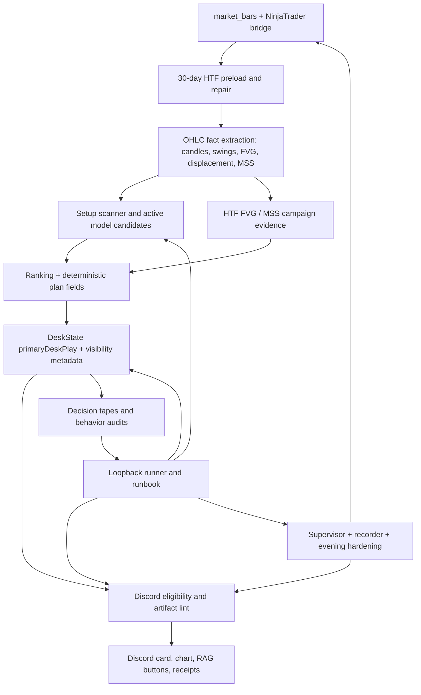

# New Project Workflow Runbook

## Scope

This runbook treats the New project work as one end-to-end scanner improvement workflow:

```text
NinjaTrader OHLC / market_bars
-> structured HTF/5M facts
-> MSS/FVG/session evidence
-> setup scanner and ranking
-> DeskState and visibility policy
-> Discord/chart/RAG presentation
-> supervisor, recorder, and evening hardening
-> replay/loopback evidence
```

Hidden Codex sidebar chats are not directly readable from this repository. When a thread-reading tool is unavailable, the durable sources of truth are:

- `docs/PROJECT_STATUS.md`
- `docs/DESK_STATE_PHASE_HANDOFF.md`
- `docs/HTF_FVG_MEMORY_PHASES.md`
- scanner decision tapes under `tools/automation/discord-audit`
- generated replay/audit reports under ignored `reports` or `tools/automation/*diagnostics*` folders
- local supervisor logs under `logs/supervisor`

This workflow remains decision-support only. The loopback runner is read-only and does not post Discord messages, start trades, approve execution, change `canExecute`, or alter entry/stop/target/risk rules.

## Overall Objective

The objective is a disciplined scanner that communicates one current desk read without flooding Discord, while still surfacing high-quality conditional plans and preserving app-owned execution authority.

The desk must:

- load enough 5M, 15M, 60M, 120M, and 240M structured OHLC context before making HTF/MSS claims;
- identify MSS/FVG/session evidence from OHLC, not narrative text;
- keep 5M as execution authority;
- use HTF as map, context, target management, support, conflict, and caution;
- preserve deterministic entry, stop, T1, T2, invalidation, risk, session, and `canExecute` gates;
- explain Discord holds and suppressions instead of silently losing meaningful structured evidence;
- avoid stale, duplicate, already-left-behind, or low-quality Discord posts;
- keep evening maintenance/data-quality notices useful and not noisy.

## Project Map



## Item Status, Evidence, And Risk

| Item | Current status | Required verification/evidence | Risk if incomplete |
| --- | --- | --- | --- |
| Audit Live Scanner Overposting | Implemented through Phase A/B/C/Phase 11 delivery boundaries, Desk Play fingerprints, artifact lint, and scanner behavior audits. | `tools/automation/scanner-behavior-audit.test.ts`, `tools/automation/scanner-discord-family-audit.test.ts`, `src/lib/liveDiscordPostEligibility.test.ts`, `tools/automation/nt-scanner-alert.test.ts`, real decision-tape audit for the trade date. | Discord flood, duplicate same-candle posts, stale/no-chase levels shown as fresh entries, high-quality conditional plans buried by stale maps. |
| Add MSS evidence tracking | Implemented as structured OHLC-derived timeframe evidence for 5M/15M/60M/120M/240M, plus active ruleset audit metadata. | `src/lib/timeframeMssEvidence.test.ts`, `src/lib/multiTimeframeCampaignEvidence.test.ts`, `src/lib/activeTimeframeMssRulesetAudit.test.ts`, `tools/automation/htf-mss-actual-ohlc-replay.test.ts`, `tools/automation/thirty-day-active-mss-plan-replay.test.ts`. | Missed MSS evidence, false HTF conflict, thin-history reads treated as no setup, or HTF structure used without sufficiency disclosure. |
| Review Live Scanner Behavior | Implemented with live observer and scanner behavior audit over decision tapes. | `tools/automation/live-desk-observer.test.ts`, `npm run live:desk-observer -- --trade-date <date> --instrument MES --session morning --json`, evening equivalent, and decision-tape JSON. | Live scanner appears quiet or noisy without explaining whether it posted, held, duplicated, or suppressed a plan. |
| Cleanup DeskState phases | Implemented as a shared DeskState/visibility architecture with primary desk play, lifecycle traces, active tactical lines/zones, HTF FVG reaction routing, and fresh re-entry conditional display. | `src/lib/localScannerEngine.test.ts`, `tools/automation/discord-alert-format.test.ts`, `src/agents/scannerPlanSelectionAgent.test.ts`, `tools/automation/fresh-reentry-phase3-loopback.ts`. | Wrong primary side, conflicting chart vs Discord text, valid watch/conditional plan disappearing before Discord, or stale "pending" text when levels exist. |
| Audit evening scanner hardening | Implemented for supervisor status, recorder/bridge health, maintenance-break awareness, HTF-only notice filtering, and data-quality notice cleanup. | `tools/supervisor/readinessDrill.test.ts`, `tools/supervisor/supervisor.test.ts`, `tools/automation/market-data-ingestion.test.ts`, `tools/automation/live-discord-rollout.test.ts`, `npm run supervisor:status`. | Chasing fake stale-bar issues during the futures maintenance break, repeated evening data-quality noise, missed real 5M/bridge blockers, duplicate scanner/recorder processes. |
| Hidden "Show more" work: HTF FVG memory, active tactical zone migration, high-confidence conditional plans, fresh tactical re-entry | Implemented across HTF FVG full-window inventory/lifecycle/routing, active reaction memory, Discord boundary rules, and approved conditional re-entry display only. | `docs/HTF_FVG_MEMORY_PHASES.md`, `src/lib/htfFvgReactionMemory.test.ts`, `src/lib/htfFvgReactionRoutingPhase3.test.ts`, `tools/automation/fresh-reentry-phase3-loopback.ts`, real-tape scanner audits. | Full-window HTF FVGs drift out of routing, reaction zones get missed after display truncation, stale lower-timeframe maps overrule active bearish/bullish context, or conditional re-entry never appears after line acceptance. |

## End-To-End Loopback

The project loopback has three layers.

### Layer 1: deterministic local proof

Run:

```bash
npx tsx tools/automation/new-project-workflow-loopback.ts
```

This validates the core scanner workflow using checked-in deterministic tests:

- scanner behavior and Discord family overposting fixtures;
- live observer fixtures;
- MSS evidence and active MSS ruleset fixtures;
- 30-day active MSS replay contracts;
- DeskState and live Discord eligibility;
- Discord formatter and artifact lint;
- market-data ingestion;
- live Discord rollout gates;
- supervisor readiness;
- fresh re-entry old-vs-new loopback.

Pass criteria:

- every non-skipped check exits `0`;
- summary reports `fail=0`;
- runner authority reports read-only and no trading/canExecute changes.

### Layer 2: real decision-tape audit

Run when durable decision tapes exist for the date:

```bash
npx tsx tools/automation/new-project-workflow-loopback.ts --real-tapes --trade-date=2026-06-24 --instrument=MES
```

Equivalent direct commands:

```bash
npm run diagnostic:scanner-behavior-audit -- --trade-date 2026-06-24 --instrument MES --sessions all --json
npm run live:desk-observer -- --trade-date 2026-06-24 --instrument MES --session morning --json
npm run live:desk-observer -- --trade-date 2026-06-24 --instrument MES --session evening --json
```

Pass criteria:

- no unresolved candidate-vs-DeskState conflict;
- no high-confidence full-level plan suppressed for an unapproved reason;
- no duplicate unchanged Desk Play posted;
- no stale/no-chase or already-passed levels presented as fresh entries;
- no HTF FVG routing boundary drift;
- no Discord sign-off block unless the report names an actionable data-quality or policy reason.

### Layer 3: full repository gate

Run before declaring the workflow clean:

```bash
npx tsx tools/automation/new-project-workflow-loopback.ts --full
npm run workflow:loopback -- --real-tapes --archive-signoff --trade-date=<date> --instrument=MES --session=<morning|lunch|evening>
npm run guard:no-firebase
npm run guard:architecture
npm run guard:schema
npm run lint
npm run build
```

Pass criteria:

- all runner checks pass;
- Firebase, architecture, schema, lint, and build pass;
- `git diff --check` has no whitespace errors;
- any Supabase migration added in the same change has an applied/not-applied status documented.
- if `--archive-signoff` is used, a manifest exists under `logs/supervisor/live-signoff-manifests/<trade-date>/` and reports `ready` before live Discord evidence is accepted.

### Layer 4: post-restart live signoff

Run after scanner or supervisor restart, before treating Discord live-format evidence as clean:

```bash
npm run supervisor:phase6-signoff -- --trade-date <yyyy-mm-dd> --instrument MES --session <morning|lunch|evening> --since-recorded-at <scanner-restart-iso> --json
```

From the Windows tray, use:

```text
Quant Desk Supervisor -> Open Live Signoff
```

The tray helper runs `npm run supervisor:phase6-signoff -- --json`, writes a local report under `logs/supervisor/live-signoff`, and opens the report. It is read-only: it does not post Discord, start scanner services, write Supabase, change scanner state, change trading logic, or change `canExecute`.

For an archived checkpoint, run:

```bash
npm run supervisor:signoff-manifest -- --trade-date <yyyy-mm-dd> --instrument MES --session <morning|lunch|evening> --json
```

The manifest is saved under `logs/supervisor/live-signoff-manifests/<trade-date>/` and records the supervisor signoff status, Phase 6 status, latest completed 5M, latest DeskState primary side, latest line in the sand, Phase 4/5 failure counts, active HTF FVG routing event counts, and the linked observer JSON path.

For an end-of-day evidence bundle, run:

```bash
npm run supervisor:eod-bundle -- --trade-date <yyyy-mm-dd> --instrument MES --session <morning|lunch|evening> --json
```

The bundle is saved under `logs/supervisor/end-of-day-evidence/<trade-date>/<instrument>/<session>/` and copies the signoff manifest, scanner decision tape, Phase 6 observer JSON, and a supervisor status snapshot into one dated folder.

For a compact operator readout of an existing bundle, run:

```bash
npm run supervisor:eod-summary -- --trade-date <yyyy-mm-dd> --instrument MES --session <morning|lunch|evening>
```

The summary reads the local bundle manifest and prints `ready`, `blocked`, `unavailable`, or `missing` without opening the full JSON archive. It is read-only and does not create, copy, post, start, stop, or repair anything.

`npm run supervisor:status` also includes the latest local `endOfDayEvidenceSummary` field so the supervisor dashboard can show whether the most recent evidence bundle is ready, blocked, unavailable, or missing without running a separate command.

Pass criteria:

- supervisor signoff status is `ready`;
- Phase 6 status is `pass`;
- live observer Discord signoff is `ready`;
- Phase 4 failures are `0`;
- Phase 5 failures are `0`;
- active HTF FVG routing events and Phase 5 contract events are present when expected for the session.
- end-of-day bundle status is `ready` when used, with no missing signoff/tape/observer/status files.
- end-of-day summary status is `ready` when used, with all bundle files present.

## Test Case Matrix

| Case | Area | Required proof |
| --- | --- | --- |
| Same-candle duplicate Desk Play refresh | Overposting | `scanner-discord-family-audit-fixture`, `nt-scanner-alert` |
| Stale/no-chase plan with levels already left behind | Overposting | `scanner-behavior-audit-fixture`, `live-desk-observer-fixture`, `live-discord-post-eligibility` |
| High-confidence conditional plan with complete levels | Discord routing | `discord-alert-format`, `live-discord-post-eligibility`, real-tape scanner audit |
| Opposite-side candidate vs active HTF FVG reaction | DeskState/HTF routing | `live-desk-observer-fixture`, `scanner-behavior-audit-fixture` |
| Fresh tactical re-entry after line acceptance | Fresh re-entry | `fresh-reentry-phase3-loopback`, `local-scanner-engine` |
| 30-day HTF sufficiency and data-limited wording | MSS/HTF | `thirty-day-active-mss-plan-replay`, `htf-mss-actual-ohlc-replay` |
| 5M/15M/60M/120M/240M MSS evidence | MSS evidence | `mss-evidence`, `multi-timeframe-campaign-evidence`, `active-mss-ruleset-audit` |
| Evening HTF-only data-quality noise | Evening hardening | `nt-scanner-alert`, `live-discord-rollout`, `supervisor-readiness-drill` |
| Maintenance-break stale heartbeat | Evening hardening | `supervisor-runtime`, `supervisor:status` during/after maintenance break |
| Post-restart live-format signoff | Supervisor/restart workflow | `supervisor:phase6-signoff`, `supervisor:signoff-manifest`, `supervisor:eod-bundle`, `supervisor:eod-summary`, tray `Open Live Signoff`, local `logs/supervisor/live-signoff`, `logs/supervisor/live-signoff-manifests`, and `logs/supervisor/end-of-day-evidence` reports |
| Discord chart/text/RAG artifact consistency | Presentation | `discord-alert-format`, `discord-cleanup-verification.test.ts`, visual QA when rendering actual cards |

## Data Sources And Environment

Required local sources:

- `market_bars` Supabase table when configured;
- NinjaTrader bridge at the configured local URL when repairing/backfilling;
- `tools/automation/discord-audit/scanner-decision-tape-<date>-<instrument>-<session>.json`;
- `logs/supervisor/candle-recorder-heartbeat.json`;
- `logs/supervisor` scanner/recorder/supervisor logs.

Important environment:

- `QUANT_DESK_SCANNER_WEBHOOK_URL` or scanner webhook config for live posting only;
- `QUANT_DESK_LIVE_DISCORD_POLICY_CONFIRMED=true` only when intentionally allowing live scanner Discord;
- Supabase env for `market_bars` and RAG persistence;
- NinjaTrader bridge running for live repair/backfill;
- canonical Discord outcome secret loaded from `.env.local` for RAG buttons.

The loopback runner does not require live Discord. Real-tape mode requires decision tapes. Bridge-backed diagnostics require NinjaTrader or cached `market_bars`.

## Failure Handling

If deterministic loopback fails:

1. Fix the failing owner, not a downstream formatter workaround.
2. Re-run the failing individual check.
3. Re-run `npx tsx tools/automation/new-project-workflow-loopback.ts`.
4. Run full guards before closing.

If real-tape audit fails:

1. Identify whether the failure is market data, scanner logic, DeskState lifecycle, Discord eligibility, artifact formatting, or supervisor delivery.
2. If OHLC is incomplete, repair/backfill first; do not infer missing candles from screenshots.
3. If Discord suppressed a high-quality conditional plan, check `liveDiscordPostEligibility`, duplicate ledger state, stale/no-chase flags, and artifact lint before touching trading logic.
4. If chart and text disagree, fix the shared presentation/DeskState source, not just one renderer.
5. If evening data-quality noise appears while completed 5M is healthy, adjust presentation/cadence filtering only.

## Project-Level Pass/Fail Criteria

The New project workflow passes when:

- deterministic loopback passes with `fail=0`;
- real decision-tape audit for the target trade date has no unresolved overposting, stale-entry, high-confidence suppression, or DeskState conflict;
- supervisor readiness reports no child-service, stale-data, duplicate-process, or failed-delivery blockers outside expected market maintenance;
- Discord payload validation guarantees complete levels, chart requirements, RAG button policy, no duplicate labels, and no stale pending text when levels exist;
- full guards, lint, and build pass.

The workflow fails when any of these occur:

- a fresh high-quality conditional plan with complete scanner-owned levels is silently buried without a valid duplicate/stale/data-quality reason;
- a stale/no-chase plan is displayed as a fresh entry;
- HTF/MSS output claims structure with insufficient 30-day context;
- 5M execution authority is bypassed;
- chart levels and Discord text disagree;
- evening maintenance creates repeated false operational alerts;
- supervisor status is ambiguous about scanner/recorder ownership or bridge freshness.

## Remaining Risks And Follow-Up

- Hidden Codex sidebar chats cannot be imported from the repo unless a thread export or thread-reading tool is provided. Durable repo evidence has been used instead.
- Live Discord delivery still requires active webhook configuration and explicit live policy confirmation. The loopback runner intentionally does not post.
- Old-format decision tapes can remain `not_evaluable` for newer Phase 4/5 routing proof when they predate the required fields. Regenerate fresh scanner/replay evidence instead of hand-editing historical tapes.
- Suppressed duplicate, stale, no-chase, or otherwise non-deliverable selected-candidate side drift is a warning. It becomes a hard sign-off blocker only when primary route metadata, campaign metadata, approval-boundary metadata, Phase 5 routing contract, or an actual trader-facing selected plan conflicts.
- Real OHLC replay quality depends on `market_bars` coverage and NinjaTrader bridge repair. Data-limited HTF context remains a blocker state, not a no-setup conclusion.
- Actual rendered chart-card visual QA still requires generating the PNG and inspecting it before posting a new visual artifact.

Recommended follow-up tasks:

- Add the loopback runner to the standard pre-Discord sign-off checklist after every scanner phase.
- Use tray `Open Live Signoff`, `npm run supervisor:phase6-signoff -- --json`, `npm run supervisor:signoff-manifest -- --json`, `npm run supervisor:eod-bundle -- --json`, or `npm run supervisor:eod-summary` after scanner/supervisor restarts before approving live-format Discord evidence.
- Run real-tape mode at the end of each trading day for morning, lunch, and evening sessions.
- Keep a dated markdown result beside major behavior audits so future drift can be compared against known-good output.
